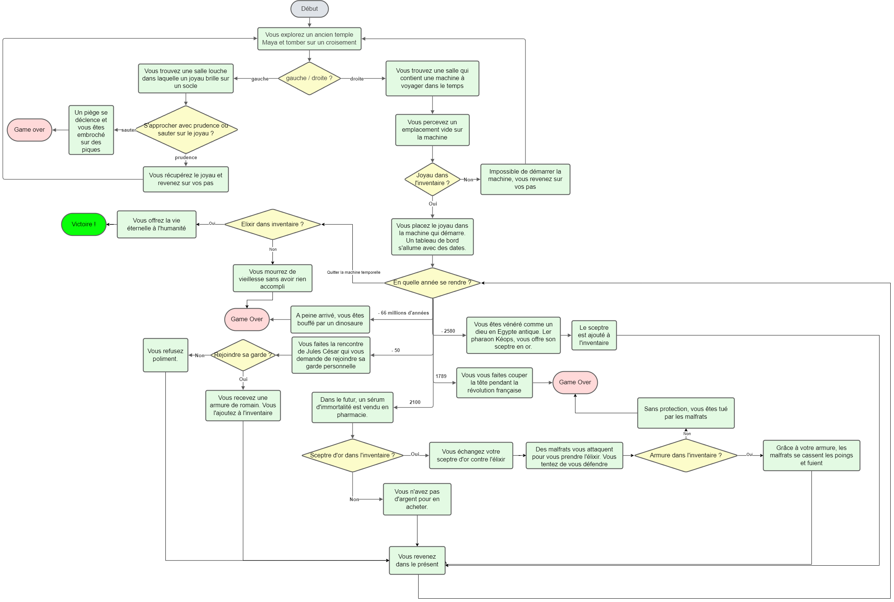

(divers.aventure2)=

# Projet

Il est temps de mettre en pratique vos compétences de programmeur pour développer un petit jeu textuel en histoire interactive.
Le projet peut être réalisé par groupe de 2 ou seul.

## Consignes (temporaire, peut être mis à jour)

Le cahier des charges est le suivant:

- créer une histoire interactive où l'utilisateur peut interragir avec le programme pour prendre des choix
- le programme correspond au logigramme du jeu
- au moins 4 questions à choix multiples posées à l'utilisateur au cours de l'histoire (3 si projet seul)
- au moins 3 tests automatiques se faisant sur l'inventaire ou sur une variable d'état (ex: vie ou argent) (2 si projet seul)
- un système d'inventaire est mis en place et il est possible de ramasser au moins 2 objets différents qui ont des conséquences concrètes sur l'histoire
- au moins 1 variable est utilisée pour représenter un état (ex: argent, vie, score, etc) et cette variable a des conséquences concrètes sur l'histoire
- au moins 1 boucle permettant de revenir à un point antérieur dans l'histoire (ex: revenir au début pour explorer d'autres chemins)
- au moins 1 possibilité de gagner dans le jeu
- au moins 1 possibilité de perdre dans le jeu
- le joueur ne peut pas se retrouver bloquer dans le jeu
- gestion des erreurs de l'utilisateur (ex: le programme repose la question si la réponse n'est pas comprise)
- le code est bien structuré et facile à lire (ex: les indentations sont correctes, les if elif else sont utilisés correctement, etc)
- (bonus) histoire particulièrement complexe et/ou créative
- (bonus) ajout d'éléments/notions non-vus en classe

Vous aurez à rendre le logigramme représentant votre jeu (`.png`) et le code (`.py`) du programme.

**Le respect de tous les critères garantit la note de 5 au minimum. Tout élément supplémentaire pourra faire monter la note jusqu'à 6.**

```{admonition} Plagiat et tricherie
:class: attention
Vous n'êtes pas autorisé à simplement copier-coller du code trouvé dans les exercices, sur Internet où dans d'autres groupes.

Il est cependant autorisé de s'inspirer de code d'autrui. Dans ce cas, il vous est demandé d'ajouter un commentaire dans le code indiquant sa source.

L'utilisation d'IA génératives telles que ChatGPT est autorisée à des fins d'assistance uniquement pour trouver des idées d'histoires. Il n'est pas autorisé d'utiliser directement le code produit par une IA (sachez que cela se voit tout de suite).

Enfin, **chaque ligne de code doit pouvoir être expliquée et défendue par le groupe**. L'enseignant se réserve le droit d'interroger le groupe sur le code en cas de doute. Un membre du groupe peut avoir une note différente de son binôme s'il est révélé que sa contribution est nettement inférieure.
```

## Exemple

Le logigramme suivant respecte tous les critères du cahier des charges **sauf pour la variable d'état**.



Le code associé vous sera fourni quand vous commencerez à développer votre jeu.
