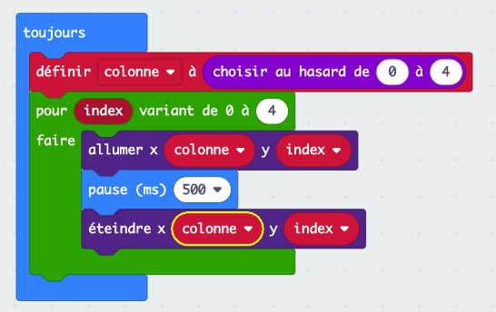
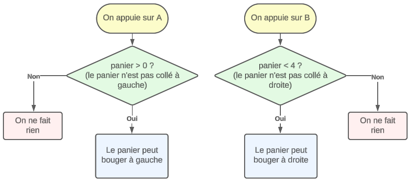
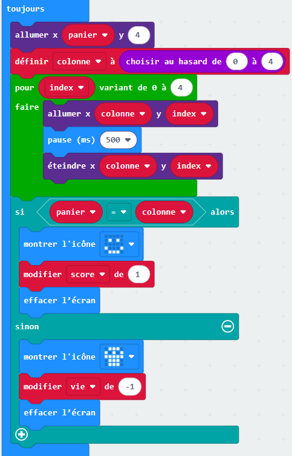
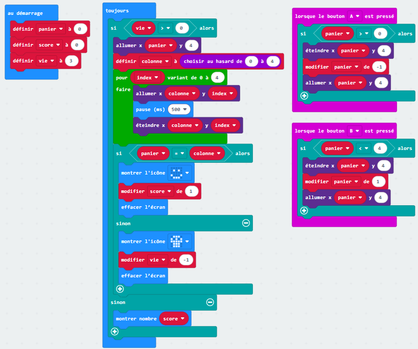

(divers.catch_the_fruit)=

# Catch the fruit

## Introduction

Dans ce TP, nous allons programmer un petit jeu sur `micro:bit`. Le micro:bit est un ordinateur minimaliste qui prend la forme d’une carte sur laquelle on trouve, entre autres, un écran de diodes lumineuses et deux boutons.


Le but de l'activité est de programmer un jeu appelé `catch the fruit`.

L'idée est d'utiliser la matrice de 25 leds du micro:bit comme écran sur lequel un fruit représenté par 1 led va tomber du haut de l'écran et qu'il faudra rattraper dans un panier. Le panier sera déplaçable à l'aide des boutons A et B.


## Mise en place

## Etapes à programmer

Voici les différentes étapes que nous allons suivre afin de programmer le jeu:

1. Faire tomber un fruit du haut de l'écran
2. Déplacer le panier à l'aide des boutons
3. Détecter lorsqu'un fruit est attrapé (i.e. collision fruit-panier)
4. Gestion des échecs (i.e. fruit n'est pas attrapé)
5. Fin du jeu et affichage du score

## Étape 1 - Faire tomber un fruit

Nous allons programmer un fruit qui tombe sur une des 5 colonne choisie aléatoirement.  
Sur l'interface de programmation, vous voyez 2 blocs déjà présents:

* `au démarrage`: les blocs posés dans ce bloc ne s'effectuent **qu'une seule fois** au démarrage du programme.
* `toujours`: les blocs posés dans ce bloc s'effectuent **en boucle** tant que le programme tourne.

### Exercice 1

Nous allons commencer par faire tomber le fruit sur la colonne 1, c'est à dire la 2ème colonne en partant de la gauche.  
Chaque led possède des coordonnées `x` et `y`. Le led tout en haut à gauche se trouve aux coordonnées `(0, 0)` tandis que celui tout en bas à droite se trouve aux coordonnées `(4, 4)`.

Ajoutez des blocs `allumer` dans le bloc `toujours` pour allumer tous les blocs de la colonne 1.

```{dropdown} Voir la solution

```

### Exercice 2

Ajoutez à présent les blocs `éteindre` pour allumer et éteindre successivement tous les leds de la colonne du haut vers le bas.

Problème: vous ne voyez rien ! Pourquoi ? Car les led s'allument et s'éteignent trop vite pour que vous puissiez les voir.  
Pour résoudre ce problème, ajoutez des blocs `pause` de 500ms après chaque allumage afin que la led ne s'éteigne pas immédiatement après avoir été allumé.

```{dropdown} Voir la solution

```

### Exercice 3

En regardant de plus près les blocs utilisés, on remarque la répétition des 3 mêmes blocs : `allumer`, `pause` et `éteindre`. Chaque bloc est répété 5 fois.  
Quand on a une répétition d'instructions, on veut que ce soit l'ordinateur qui fasse le travail ! On utilise alors des **boucles**.

```{question}
Dans votre code, quelle est l'unique valeur qui change à chaque répétition des 3 blocs `allumer`, `pause` et `éteindre` ?

* {f}`La durée de la pause`
* {f}`La coordonnée horizontale x`
* {v}`La coordonnée verticale y`
* {f}`Aucune idée`
===
La coordonnée verticale `y` est la seule à changer entre chaque répétition. C'est le cas car le fruit tombe du haut vers le bas, et donc la coordonnée `y` est augmentée de 1 à chaque tour.
```

L'idée est donc d'utiliser une boucle qui va répéter les instructions tout en augmentant `y` de 1 à chaque tour afin de faire tomber le fruit.

Utilisez le bloc `pour index variant de 0 à 4` qui va créer une **boucle** dans laquelle `index` va prendre successivement les valeurs de 0 à 4, ce qui est exactement ce qu'il nous faut pour les valeurs de `y`.  
`index` est ici ce que l'on appelle une `variable`. Sa valeur va **varier** de 0 à 4 à chaque tour. Il faut donc ensuite remplacer les valeurs de `y` par `index`.

```{dropdown} (Aide) Montrez moi les étapes à suivre
Voici les étapes à suivre:

1. Dans le bloc `toujours`, gardez une seule répétition des blocs `allumer`, `pause` et `éteindre`. Supprimez les autres blocs.
2. Insérez le bloc `pour index variant de 0 à 4` autour des blocs restants.
3. Remplacez la valeur de `y` par la variable `index`.
```

```{dropdown} Voir la solution

```

### Exercice 4

Le fruit tombe toujours dans la même colonne, on veut changer aléatoirement de colonne pour chaque fruit.

Pour choisir un nombre au hasard, on peut utiliser le bloc `choisir au hasard de 0 à 10` du menu `Maths`.  
Ce bloc permet de tirer un entier aléatoire entre 2 bornes, dans notre cas de 0 à 4 pour les 5 colonnes possibles.

* Comment et où utiliser ce bloc ?

Il faut choisir un nombre au hasard qui va être la colonne choisie et il faut pouvoir conserver ce choix tout au long de la chute du fruit.  
Dès l'instant où on veut stocker de l'information pour pouvoir la réutiliser, la solution est d'utiliser une `variable`.

```{dropdown} (Aide) Montrez moi les étapes à suivre
Voici les étapes à suivre:

1. Dans la catégorie de blocs `Variables`, choisissez `Créer une variable` et donnez lui le nom `colonne`. Cette variable aura pour objectif de stocker le numéro aléatoire de la colonne dans laquelle va tomber le fruit.
2. Utilisez ensuite le bloc `définir colonne à` pour donner la valeur aléatoire à la variable `colonne`.
3. Remplacez les coordonnées de `x` par la valeur de la variable `colonne`.
```

```{dropdown} Voir la solution

```

Fin de l'étape 1, on a un fruit qui tombe dans une colonne choisie aléatoirement.

## Étape 2 - Déplacer le panier

Nous allons programmer le panier qui se déplace de droite à gauche à l'aide des boutons `A` et `B`.

### Exercice 5

Pour commencer il faut choisir comment sera représenté le panier. Nous utiliserons 1 seule led sur la ligne tout en bas (coordonnée `y` à 4).

* La position du panier va changer au cours du jeu, comment faire pour stocker de l'information qui varie ? (utiliser une variable)
* Que doit-on représenter avec cette variable ? (la position en `x` du panier)

Définissez une variable `panier` pour la coordonnée horizontale du panier qui va varier et initiez-la à 0 au début du programme.
N'oubliez pas d'allumer les leds correspondantes, sinon on ne verra pas le panier !

```{dropdown} (Aide) Montrez moi les étapes à suivre
Voici les étapes à suivre:

1. Créez une nouvelle variable nommée `panier`.
2. Dans le bloc `au démarrage`, ajoutez un bloc `définir panier à 0` pour définir la position initiale du panier à 0 (tout à gauche).
3. Ajoutez un bloc `allumer` afin d'allumer la led à la position du panier.
```

```{dropdown} Voir la solution

```

### Exercice 6

Le panier est fixe, il faut le faire bouger.  
Nous allons utiliser les boutons `A` et `B` pour les déplacements gauche et droite, respectivement.  

* Que signifie déplacer le panier à gauche en termes de positions ? (diminuer les valeurs de ses coordonnées en `x` de 1)
* Que doit-il se passer visuellement ? (éteindre les leds de la positon actuelle, faire le déplacement, allumer les leds de la nouvelle position)

Utilisez les blocs `lorsque le bouton ... est pressé` et ajoutez-y les blocs permettant de déplacer le panier. Le bloc `modifier panier de 1` permet d'augmenter la valeur de la variable `panier` de 1. Changez le 1 en -1 afin de diminuer sa valeur.

```{dropdown} (Aide) Montrez moi les étapes à suivre
Voici les étapes à suivre:

1. Ajoutez un bloc `lorsque le bouton A est pressé`.
2. A l'intérieur, ajoutez un bloc `éteindre` pour éteindre la led du panier.
3. Modifiez la valeur de la variable `panier` pour la diminuer de 1. Pour cela, ajoutez un bloc `modifier panier de -1`.
4. Ajoutez un bloc `allumer` pour allumer la led correspondant au nouvel emplacement du panier.
5. Faites la même chose pour le bouton `B` qui doit permettre de déplacer le panier vers la droite.
```

```{dropdown} Voir la solution

```

### Exercice 7

Si on appuie de nombreuses fois sur le bouton `A` ou `B`, le panier disparait, il sort de l'écran.  
On doit empêcher le panier d'aller plus loin que les bords de l'écran.

* Pourquoi est-ce que le panier sort de l'écran ? (la variable `panier` continue d'être modifiée pour finalement allumer des leds à des coordonnées qui n'existent pas)
* Comment empêcher la modification des variables ? (conditionner les modifications selon la position du panier)
* Sous quelle condition le panier peut-il se déplacer à gauche ? (si sa position en `x` est > 0)
* Sous quelle condition le panier peut-il se déplacer à droite ? (si sa position en `x` est < 4)

On introduit ici la structure de contrôle conditionnelle `si ... alors ...` et les tests de comparaison qui *répondent* `vrai` ou `faux` et servent de condition à l'exécution d'instructions.  
Dans notre cas, on déplace le panier **uniquement si** ça ne le fait pas sortir de l'écran.



Donc pour le bouton `A`, on exécute les blocs permettant le déplacement du panier que s'il n'est pas déjà tout à gauche.

```{dropdown} (Aide) Montrez moi les étapes à suivre
Voici les étapes à suivre:

1. Ajoutez un bloc `si vrai alors` **autour** des instructions permettant de déplacer le panier vers la gauche (bouton `A`).
2. Remplacez `vrai` par le **test de comparaison** qui permet de contrôler que la position du panier est > 0. Les blocs de comparaison de trouve dans le menu `Logique`.
3. Faites la même chose pour le déplacement vers la droite (en ajustant le test de comparaison).
```

```{dropdown} Voir la solution

```

Fin de l'étape 2, on a un panier déplaçable à l'aide des boutons.

## Étape 3 - Détecter lorsqu'un fruit est attrapé

### Exercice 8

Il s'agit maintenant de détecter lorsque le fruit est attrapé par le panier, c'est-à-dire lorqu'il y a collision entre le fruit et le panier.

Visuellement il est facile de *voir* quand le fruit tombe dans le panier, mais comme le micro:bit ne *voit* pas, il faut trouver une autre solution pour qu'il puisse vérifier s'il y a collision ou non.

* A quelle condition y a-t-il collision entre le fruit et le panier ? (lorsque les coordonnées du fruit et du panier sont les mêmes)
* Quelles sonts les coordonnées du panier et du fruit ? (comme elles changent, elles sont dans des variables. Fruit(`colonne`, `index`) et panier(`panier`, `4`))
* Comment s'écrit l'égalité des coordonnées avec ces variables ? (`colonne == panier ET index == 4`)

Traduisez cette égalité avec les blocs de `comparaison` à votre disposition dans la section `Logique`.  
Placez ensuite le test de comparaison dans un bloc `si ... alors ...`.

Nous verrons ensuite où nous devrons placer ce test de collision.

```{dropdown} Voir la solution

```

### Exercice 9

On a maintenant un test permettant de détecter la collision entre un fruit et le panier, mais on fait quoi ?  
Il s'agit de déterminer à quel moment du jeu il faut faire ce test, mais aussi quelles sont les actions à réaliser lorsqu'il y a collision.

* A quel moment veut-on tester la collision ? (après chaque déplacement du fruit, dans la boucle `répéter`)
* Que doit-il se passer lorsqu'on attrape un fruit ? (on augment le score de 1)
* Comment faire pour tenir le score à jour ? (il faut utiliser une variable)

Vous devez donc créer une nouvelle variable pour le `score` que vous allez initialiser à 0 `au démarrage`.  
Le test de collision doit se faire à chaque déplacement du fruit.  
Lorsqu'une collision a lieu, augmentez le score de 1.

En outre, on peut également *fortement* suggérer de donner un signal visuel au joueur lorsqu'il marque un point, avec l'apparition d'un smiley par exemple.

```{dropdown} (Aide) Montrez moi les étapes à suivre
Voici les étapes à suivre:

1. Créez une nouvelle variable nommée `score` et définissez-la à 0 `au démarrage`.
2. Ajoutez le bloc conditionnel testant la collision à la fin de la boucle faisant tomber le fruit.
3. Si la condition est respectée, affichez un smiley avec le bloc `montrer l'icône`.
4. Si la condition est respectée, augmentez le `score` de 1.
5. Si la condition est respectée, ajoutez un bloc `effacer l'écran` afin d'effacer le smiley.
```

```{dropdown} Voir la solution

```

Vous remarquerez que nous avons ajoué un bloc `allumer x panier` au début du bloc `toujours`. Sans ce bloc, le panier disparaît lorsqu'il entre en collisin avec un fruit.  
L'ajout de ce bloc permet de rallumer la led associée au panier avant la chute d'un fruit.

Fin de l'étape 3, le jeu détecte la collision entre le panier et le fruit.

## Étape 4 - Gestion des échecs

### Exercice 10

Un échec se produit lorsqu'un fruit finit sa chute en dehors du panier. Il faut détecter lorsque ce cas se produit et également définir les actions associées.

L'échec n'est pas seulement le contraire du fruit qui tombe dans le panier, car cela inclut également tous les cas ou le fruit est en train de tomber, qu'il soit au-dessus du panier ou non.  
Il faut donc déterminer comment détecter ces cas là uniquement.

* Quels sont les positions du fruit concernés par le `sinon` du bloc permettant de détecter les collisions ? (toutes les positions sauf celles du panier)
* Toutes ces positions constituent-elles des échecs ? (non)
* Quelle condition supplémentaire doit-on avoir pour que le fruit soit tombé à côté du panier ? (index = 4)
* Que se passe-t-il lorsqu'on rate un fruit ? (perte de vie, par exemple)

Là aussi, une fois les réponses déterminées, l'implémentation ne pose pas de difficultés particulière. Comme pour la collision, on peut ajouter un signal visuel pour signifier l'échec au joueur. Dans ce cas, il ne faut pas oublier d'`effacer l'écran`. Il ne faut pas non plus oublier d'initialiser le nombre de `vies` au démarrage.

```{dropdown} Montrez moi les étapes à suivre
Voici les étapes à suivre:

1. Créez une nouvelle variable nommée `vie` et définissez-la à 3 `au démarrage`.
2. Cliquez 2x sur le petit `+` du bloc `si ...` de la collision afin de faire apparaître le `sinon si ...`.
3. Ajoutez le bloc permettant de tester l'échec dans le `sinon si ...`. Pour rappel, la condition d'échec est que le fruit soit arrivé en bas de l'écran et donc que `index` vaut 4.
4. Si la condition d'échec est respectée, affichez un smiley triste avec le bloc `montrer l'icône`.
5. Si la condition d'échec est respectée, diminuez la `vie` de 1.
6. Si la condition d'échec est respectée, effacez l'écran.
```

```{dropdown} Voir la solution

```

Fin de l'étape 4, le jeu détecte quand le joueur rate un fruit.

## Étape 5 - Fin du jeu

### Exercice 11

Le jeu est maintenant fonctionnel, on marque des points lorsqu'un fruit est attrapé et on perd une vie quand on le rate. Cependant, le jeu ne s'arrête pas même si on a perdu plus de vies qu'on en avait au départ.

Nous allons donc faire s'arrêter le jeu selon une condition à déterminer, puis nous afficherons le score du joueur.

* Quand est-ce que le jeu doit s'arrêter ? (lorsqu'on a plus de vies)
* Quelle est la condition qui permet de continuer à jouer ? (si le nombre de vies > 0)
* Quelle partie du jeu suffit-il d'empêcher pour que le jeu s'arrête ? (la chute des fruits)
* Que doit-on faire lorsque le jeu est fini ? (afficher le score)

L'arrêt du jeu s'implémente simplement en conditionnant la chute des fruits au fait d'avoir au moins une vie, l'alternative (sinon) étant la fin de partie avec affichage du score.

```{dropdown} Montrez moi les étapes à suivre
Voici les étapes à suivre:

1. Ajoutez la condition testant que `vie > 0` tout autour du code se trouvant dans le bloc `toujours`. Ainsi les fruits ne tomberont que s'il reste des vies au joueur.
2. Si la condition n'est **pas** respectée (c'est à dire s'il reste des vies), alors ajoutez le bloc `montrer nombre` afin d'afficher le score.
```

```{dropdown} Voir la solution

```

Ceci termine l'implémentation de base de ce jeu sur micro:bit.

```{dropdown} Voir le code final

```

Une version du jeu complet est disponible {download}`ici<../data/microbit-catch-the-fruit.hex>`, il suffit de télélcharger et déposer le fichier dans la fenêtre Makecode ouverte dans votre navigateur (mais attention, il remplacera votre code).

## Pour aller plus loin

Pour rendre le jeu plus intéressant, voici une liste de suggestions:

* Augmenter la vitesse de chute des fruits après un certain nombre de points
* Faire tomber de manière aléatoire des fruits pourris / bombes qui font perdre une vie si atttrapés (on peut jouer avec la luminosité pour faire la distinction)
* Faire déplacer le panier en inclinant la carte micro:bit au lieu des boutons A et B
* Faire tomber plusieurs fruits en même temps
* Faire tomber certains fruits légèrement en diagonal
* Elargir le panier à 2 leds
* Etc...

Nous n'avons fait que gratouiller la surface de ce qu'il est possible de programmer sur un micro:bit. Rendez-vous [ici](https://makecode.microbit.org/) et explorez les différents projets.
