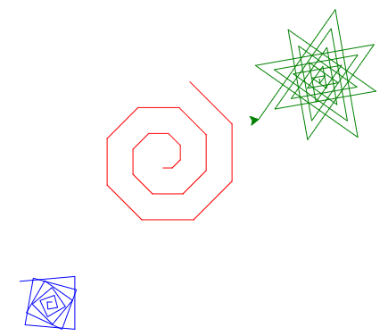

(prog_dessin.parametrer)=

# 4. Paramétrer

Dans ce chapitre, nous revenons sur le concept de la fonction. Dans le chapitre 2 nous avons vu la fonction comme une façon de donner un nom à une séquence d'instructions. Ici nous allons voir comment nous pouvons ajouter un ou plusieurs **paramètres** à une fonction. Nous allons voir que :

- l'expression `def rect(d, e):` permet de définir une fonction avec deux paramètres,
- les paramètres `d` et `e` sont des variables locales valides uniquement à l'intérieur de la définition de fonction,
- ces paramètres prennent une valeur au moment de l'appel de la fonction avec, par exemple, `rect(50, 30)`.

```{question}
En Python, `def` est un raccourci pour

{f}`défoncé`  
{f}`défilé`  
{v}`définition`  
{f}`défavorisé`
```

## Paramétrer une fonction

Jusqu'à maintenant, notre rectangle était d'une taille fixe. La fonction `rectangle()` du chapitre 2 dessine toujours un rectangle de 160 x 100 pixels. Il faudrait faire une nouvelle fonction `rectangle2()` si on voulait dessiner une taille différente.

Il serait très utile de disposer d'une fonction de la forme `rectangle(d, e)` qui puisse dessiner des rectangles de largeur et hauteur variable.
C'est possible en spécifiant des **paramètres** pour la fonction.
Un paramètre de fonction est une variable locale qui peut être utilisée dans sa définition.

Lors de l'appel de la fonction, nous donnons des valeurs à la fonction.
Ces valeurs sont les **arguments** de la fonction.

`````{exercise}
Aujoutez un deuxième rectangle avec d'autres dimensions.

```{codeplay}
from turtle import *

def rectangle(d, e):    # paramètres (d, e)
    for i in range(2):
        forward(d/2)
        write(d)
        forward(d/2)
        left(90)

        forward(e/2)
        write(e)
        forward(e/2)
        left(90)
        
rectangle(160, 100)      # largeur=160, hauteur=100 
```

````{dropdown} Solution
```python
...

rectangle(160, 100)      # largeur=160, hauteur=100 
rectangle(120, 150)      # largeur=120, hauteur=150
```
````
`````

La fonction `losange(d, a)` a comme paramètre la longueur et le premier angle. Le deuxième angle du losange est calculé automatiquement.

```{codeplay}
from turtle import *

def losange(d, a):      # paramètres (d=distance, a=angle)
    for i in range(2):
        forward(d)
        left(a)
        write(a)
        
        forward(d)
        left(180-a)
        write(180-a)

losange(100, 60)        # distance=100, angle=60
losange(140, 100)       # distance=140, angle=100
```

La fonction `polygone(d, n)` a comme paramètre la distance du côté et le nombre de sommets.

```{codeplay}
from turtle import *

def polygone(d, n):     # paramètres (d, n)
    for i in range(n):
        forward(d)
        left(360/n)
        write(360/n)

polygone(100, 3)    # triangle
polygone(100, 4)    # carré    
polygone(100, 5)    # pentagone
```

## Dessiner une maison

Revenons à notre fonction pour dessiner une maison.

````{exercise}
Ajoutez une maison de taille 100.

```{codeplay}
from turtle import *

def maison(d):
    dot()
    forward(1.41*d)  # sol
    left(90)
    forward(d)  # mur droit
    left(45)
    forward(d)  # toit droit
    left(90)
    forward(d)  # toit gauche
    left(45)
    forward(d)  # mur gauche
    left(90)

backward(200)        
maison(50)      # maison de taille 50
forward(100)
maison(70)      # maison de taille 70
```
````

## Colorier la maison

Maintenant nous modifions la fonction pour inclure non seulement la taille mais également la couleur de la maison comme paramètres. Les arguments de la fonction sont :

- `d` -- dimension de la maison
- `c` -- couleur de la maison

````{exercise}
Aujoutez deux autres maisons de taille et couleur différente.

```{codeplay}
from turtle import *

def maison(d, c):
    dot()
    fillcolor(c)
    begin_fill()
    forward (1.41*d)  # sol
    left(90)
    forward(d)  # mur droit
    left(45)
    forward(d)  # toit droit
    left(90)
    forward(d)  # toit gauche
    left(45)
    forward(d)  # mur gauche
    left(90)
    end_fill()
    color('black')

backward(200)
maison(70, 'lightblue')
forward(200)
maison(50, 'yellow')
```
````

```{admonition} Couleur de remplissage
:class: note
Avec la fonction `fillcolor(c)`, nous pouvons définir une couleur de remplissage `c` pour une forme quelconque que nous voulons dessiner. Pour remplir une forme avec une couleur, nous devons ajouter les deux fonctions :

- `begin_fill()` au début de la forme,
- `end_fill()` à la fin de la forme.
```

## Bus

Pour dessiner un bus, une voiture ou un camion simple, nous pouvons utiliser des rectangles pour le châssis, et un disque (dot) pour les roues.  
C'est une fonction qui a pour paramètres:

- `p` -- position du bus
- `d` -- dimension (longeur) du bus
- `c` -- couleur du bus

```{codeplay}
from turtle import *

def rectangle(d, e, c):
    fillcolor(c)
    begin_fill()
    for i in range(2):
        forward(d)
        left(90)
        forward(e)
        left(90)
    end_fill()
        
def bus(p, d, c):
    up()
    goto(p)
    down()
    rectangle(d, d/3, c) # chassis
    forward(d/4)
    dot(d/5)            # roue arrière
    dot(d/10, 'white')
    forward(d/2)
    dot(d/5)            # roue avant
    dot(d/10, 'white')
    up()
    
bus((-200, 50), 200, 'red')
bus((50, 20), 150, 'lightblue')
```

## Arbre

Pour dessiner un arbre simple, nous utilisons un segment droit pour le tronc et un disque (dot) pour le feuillage.  
C'est une fonction qui a 3 paramètres:

- `d` -- longueur du tronc
- `c` -- couleur du tronc
- `c2` -- couleur du feuillage

```{codeplay}
from turtle import *

def arbre(d, c, c2):
    down()
    left(90)
    width(d/6)      # tronc
    pencolor(c)
    forward(d)
    dot(d, c2)      # feuillage
    up()
    backward(d)     # retourner à la position de départ
    right(90)
    
arbre(100, 'brown', 'lime')
forward(70)
arbre(90, 'brown', 'green')
```

## Escalier

Voici une fonction permettant de dessiner des escaliers avec les paramètres suivants:

- `d` -- longueur de marche
- `e` -- hauteur de marche
- `n` -- nombre de marches

```{codeplay}
from turtle import *

def escalier(d, e, n):
    dot()   # marqueur de début
    for i in range(n):
        forward(d)
        left(90)
        forward(e)
        right(90)

escalier(20, 10, 5)
escalier(10, -20, 5)
escalier(30, 10, 4)
```

## Stickman

Voici comment dessiner de petits stickmans paramètrables !

```{codeplay}
from turtle import *

def leg(angle, d):
    left(angle)
    forward(d)
    backward(d)
    right(angle)

def stickman(d, bras, jambes):
    seth(0)         # réinitialise l'angle de la tortue
    down()
    circle(d/2)     # tête
    right(90)
    forward(d/2)    # cou
    
    leg(bras[0], d)
    leg(bras[1], d)
    forward(d)
    
    leg(jambes[0], d)
    leg(jambes[1], d)
    up()

up()
goto(-200, 0)
stickman(20, (30, -45), (10, -30))

goto(-100, 0)
stickman(20, (90, -110), (10, -30))

goto(0, 0)
stickman(30, (90, -110), (110, -24))
hideturtle()
```

## Nommer une variable

Pour nommer une variable (ou un paramètre), vous pouvez utiliser :

- lettres (`a...z` et `A...Z`),
- chiffres (`0...9`),
- le tiret bas, appelé _underscore_ (`_`).

Le nom de variable :

- est sensible aux majuscules/minuscules,
- ne peut pas commencer avec un chiffre,
- ne doit pas être un mot-clé python (`for`, `if`, `else`, `in`, etc),

Ces noms de variables sont donc valides : `a2`, `_a`, `speed`, `pos_x`, `POS_X`

```{question}
Lesquels des noms de variable sont valides ?

{f}`var 2`  
{v}`var2`  
{f}`2var`  
{v}`arc_en_ciel`  
{v}`vitesseMax`  
{f}`import`  
===
`var 2` contient une espace  
`2var` commence par un chiffre  
`import` est un mot clé
```

## Exercice récapitulatif

````{exercise}
Reprenez l'exercice récapitulatif du chapitre 3 `répéter` et créez une fonction `spirale` pour dessiner votre spirale.
La fonction doit avoir les 3 paramètres suivants:
- `a`: angle entre chaque segment
- `c`: couleur de la spirale
- `n`: nombre de segments

Appelez votre fonction 3 fois avec des valeurs différentes pour les paramètres `a`, `c` et `n`, afin d'obtenir 3 spirales différentes:



Vous n'avez pas à reproduire les mêmes spirales que dans l'image ci-dessus.

```{codeplay}
:file: ex4.py
from turtle import *

def spirale(...):
    # Code de l'exercice 3
```

Téléchargez le fichier `.py` et déposez le fichier sur Moodle à l'endroit prévu.
````
<!--
from turtle import *

def spirale(l, i, a, c, n):
    color(c)
    for i in range(n):
        forward(l)
        left(a)
        l += i
        
spirale(10, 3, 45, 'red', 20)
up()
goto(-125, -150)
down()
spirale(5, 3, 95, 'blue', 20)
up()
goto(175, 100)
down()
spirale(5, 5, 135, 'green', 30)
-->

## Et à part le dessin ?

Paramètrer une fonction permet en quelque sorte de la généraliser pour qu'elle puisse être utilisable dans plein de situations.

```{admonition} Rappel
:class: hint
- La fonction `print()` permet d'afficher du texte.
- `a = 0` est une instruction permettant de créer une variable `a` et lui donner la valeur `0`.
- `a = a + 3` permet d'ajouter 3 à la variable `a`.
```

`````{exercise}
Ecrivez une fonction qui permet de calculer l'aire d'un triangle en vous basant sur la longueur de sa base et sa hauteur.

La fonction prend donc 2 paramètres:
- `base`
- `hauteur`

```{codeplay}
# Votre code ici...
```

````{dropdown} Solution
```python
def calcul_aire(base, hauteur):
    aire = base*hauteur / 2
    print(aire)

calcul_aire(5, 10)
```
````
`````

`````{exercise}
Reprenez la solution de l'exercice final du chapitre 3 et écrivez une fonction permettant de calculer la somme des chiffres de 0 à n.

La fonction prend donc un unique paramètre: `n`.

```{codeplay}
# Votre code ici...
```

````{dropdown} Solution
```python
def calcul_somme(n):
    somme = 0
    for i in range(n+1):
        somme = somme + i
    print(somme)

calcul_somme(100)
```
````
`````
