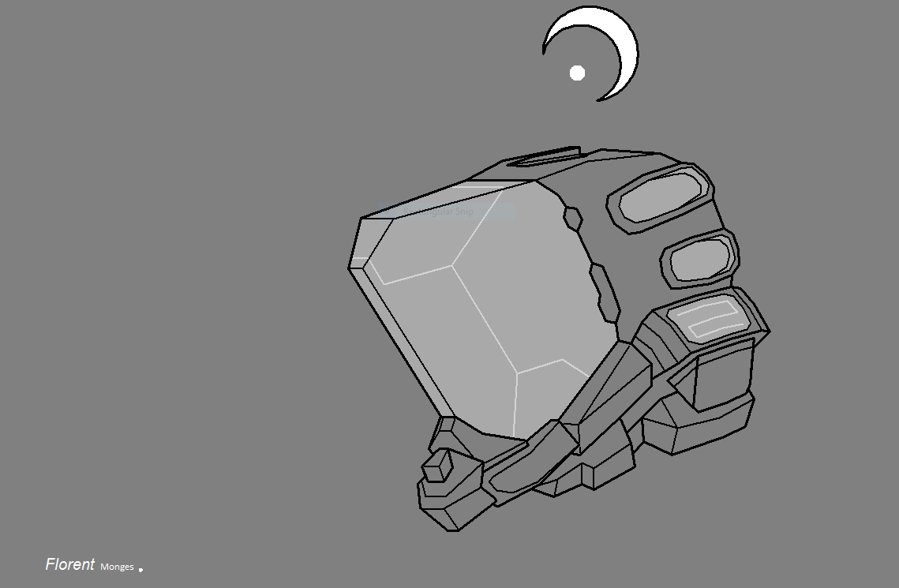
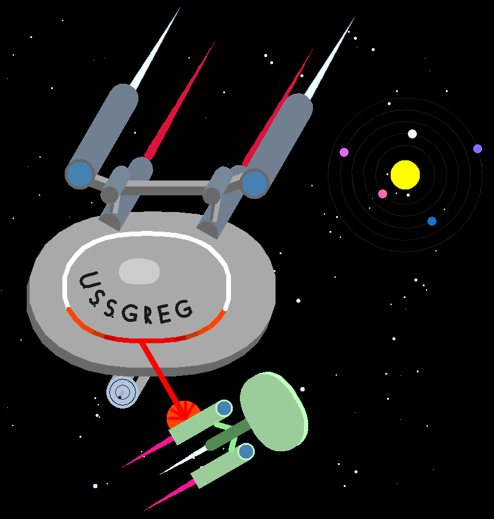

(prog_dessin.projet)=

# Projet

Il est temps de mettre en pratique vos connaissances pour réaliser un dessin libre (avec quelques contraintes).
Le projet peut être réalisé par groupe de 2.

## Template

Voici le template (fichier de base) à utiliser pour votre projet. Il vous aidera à structurer correctement votre code.
Vous travaillerez sur l'application `Thonny` afin de pouvoir sauvegarder votre travail.

{download}`Télécharger ici<../data/template_projet_dessin.py>`

## Consignes

Le cahier des charges (en construction) est le suivant:

- créer un dessin concret (pas abstrait)
- choisir un sujet libre : nature, ville, intérieur, jeux vidéo, science-fiction, etc.
- au moins 4 objets différents auxquelles l'on peut donner au moins 2 paramètres (ex: taille et couleur)
- chaque objet est défini à l'aide d'une fonction
- chaque fonction est décrite en 1-2 lignes de commentaires (voir exemple plus bas)
- les objets complexes (plus de 15 lignes de code) sont découpées en sous-fonctions
- utiliser des dots, lignes et le remplissage
- varier l'épaisseur du trait
- lever et baisser le stylo
- utiliser des cercles et des arcs de cercle
- utiliser des couleurs de ligne, point, remplissage et arrière-fond
- utiliser des variables pour nommer vos entités (largeur, hauteur, rayon, couleur)
- parcourir avec une boucle `for` des séquences de couleurs, angles, distances, et tailles
- répéter avec une boucle `for` (par exemple: hublots, traverses, fenêtres, roues, clôtures, etc)
- intégrer au moins un élément aléatoire (module `random`) dans votre dessin
- (bonus) intégrer une forme particulièrement complexe

Comme pour les exercices récapitulatifs, vous rendrez sur Moodle un fichier `.py` et une capture d'écran `.png`.

## Exemple

L'exemple ci-dessous satisfait toutes les contraintes du cahier des charges.


Copiez-collez le code du dessin dans l'application `Thonny` pour visualiser comment il est réalisé.

````{dropdown} Voir le code
```python
from turtle import *
from random import *
# from tkinter import * 

speed(0) # Permet d'accélérer le dessin

# -----------------------------------
# Définissez ici toutes vos fonctions
# -----------------------------------

def triangle(d, c):
    # Dessine un triangle équilatéral de longueur d et de couleur c
    fillcolor(c)
    begin_fill()
    for i in range(3):
        forward(d)
        left(120)
    end_fill()
        
def rectangle(w, h, c):
    # Dessine un rectangle de largeur w, de hauteur h et de couleur c
    fillcolor(c)
    begin_fill()
    for i in range(2):
        forward(w)
        left(90)
        forward(h)
        left(90)
    end_fill()
        
def montagne(d, c):
    # Dessine une montagne de taille d et de couleur c
    triangle(d, c)
    left(60)
    forward(2*d/3)
    right(60)
    triangle(d/3, 'white')
    right(120)
    forward(2*d/3)
    left(120)
    
def rayons(n, d):
    # Dessine n rayons de soleil de longueur d
    color('yellow')
    width(5)
    for i in range(n):
        forward(d)
        backward(d)
        left(360/n)
    color('black')
    
def soleil(r, n, d):
    # Dessine un soleil de rayon r avec n rayons de longueur d
    dot(r*2, 'yellow')
    rayons(n, d)
    
def nuage(d, n):
    # Dessine un nuage composé aléatoirement de n cercles de diamètre d
    for i in range(n):
        dot(d, 'white')
        left(randint(0, 360))
        up()
        forward(20)
        down()
    
def fleur(d, n, c_centre, c_petale):
    # Dessine une fleur avec un centre de diamètre d et de couleur c_centre avec n pétales de couleur c_petale
    for i in range(n):
        dot(d, c_petale)
        forward(d*0.8)
        left(360/n)
    left(60)
    forward(d*0.7)
    dot(d*0.7, c_centre)

# --------------------------------------------------------
# Ecrivez ici les appels de fonctions pour faire le dessin
# --------------------------------------------------------

dot(10000, 'green') # Background vert
up()
goto(-500, 0)
down()
rectangle(1000, 1000, 'lightblue') # Ciel

# Dessin des 4 montagnes
montagne(200, 'grey')
forward(150)
montagne(150, 'light grey')
forward(200)
montagne(250, 'silver')
backward(80)
montagne(100, 'grey')

# Dessin du soleil
up()
goto(300, 200)
down()
soleil(50, 10, 80)

# Dessin des nuages aux coordonnées prédéfinies dans une liste
for coords in [(-400, 250), (-350, 300), (-320, 200), (-250, 250), (-100, 300)]:
    up()
    goto(coords)
    down()
    nuage(40, 5)

# Dessin de 50 fleurs disposées aléatoirement dans l'herbe
up()
for i in range(50):
    x = randint(-400, 400)
    y = randint(-350, -50)
    taille = randint(5, 15)
    goto(x, y)
    fleur(taille, 5, 'gold', 'red')

hideturtle() # Cache la tortue
# Screen().getcanvas().postscript(file='classe_prenom_nom.eps') # Sauvegarde une image vectorielle
done()
```
````

## Plus d'exemples

Ces exemples ont été créés par des élèves en 3M, en option complémentaire informatique. Ils sont plus complexes que ce que vous allez faire mais peuvent servir d'inspiration.

### Jeu vidéo


### Maison de campagne


### Cadre des Pyrénées


### Japon


### Swiss space


### Maison meublée


### Casque d'astronaute



### Urbain et rural


### Star Trek



### Loup sous la lune


### Fantaisie psychédélique


### Bateaux de pêche


